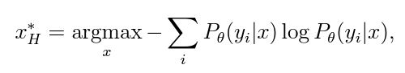
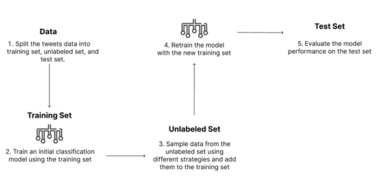
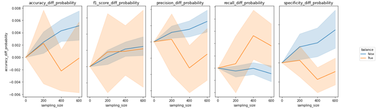
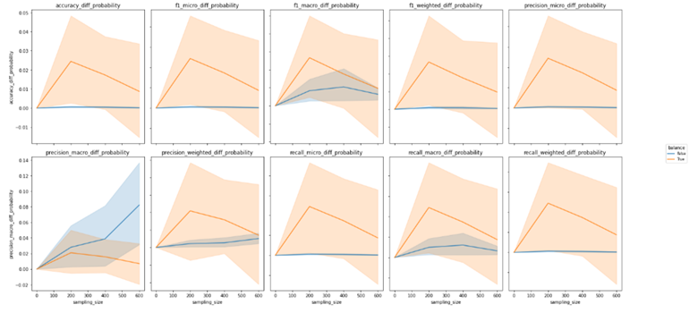
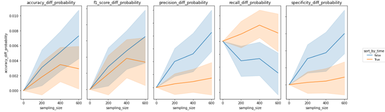
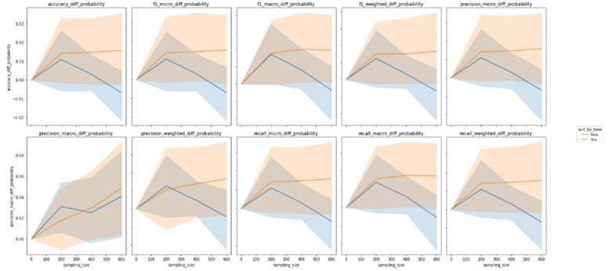
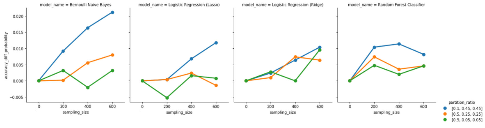
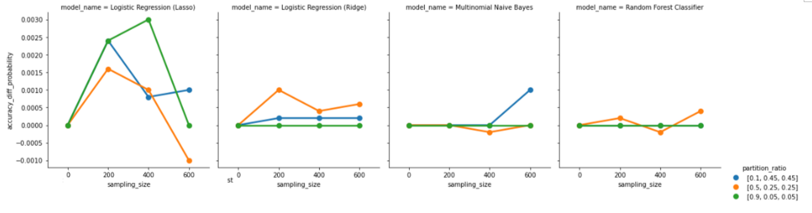
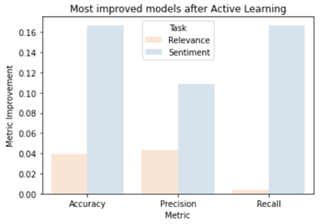
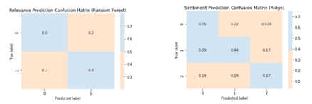

<!-- <h1> Active learning for NLP in predicting the relevance and sentiment of tweets about politics of China </h1> -->

    

    
<h2> Motivation </h2>
  <li>The US-China relationship is changing rapidly. To better understand its dynamics, monitoring and analyzing tweets posted by members of Congress becomes important. </li>
  <li>Before analyzing the tweets, there is a need to distinguish the sentimental posts from the factual posts and provide them with labels of different sentiment levels. </li>
  <li>Currently, there have been two classifiers trained using the text features from the tweets to predict the relevance and sentiment of the tweets.
   <li><strong> The goal of this project is to explore the possibility of employing an active learning pipeline to automate the labeling procedure with these two classification models while enhancing the prediction accuracy over time with new coming tweets.</strong></li>

<h2> Background </h2>

In April 2019, the China Data Lab at UC San Diego initialized the “Congress Tweets” project with the intention of exploring more about the US-China relationship. Through the Twitter API, the lab is able to collect more than 800,000 tweets related to China, posted by members of Congress in recent years. In order to distinguish the relevant sentimental tweets from the factual tweets, we built two classification models using the content of the tweet to predict the relevance and sentiment score of the tweets. By automating the process, we can save resources such as human labor and time as well as ensuring the quality of the data we feed into the analysis process.

<h4>Literature Review & Prior Work</h4>

According to Active Learning Literature Survey from the University of Wisconsin-Madison, in the field of machine learning, <strong>Active Learning is a repetitive process that utilizes a learning algorithm to search for the most informative data for the existing model, rather than training it on the entire dataset.</strong>
<\n>
<ol>
  There are three general learning scenarios for active learning. <\n>
  <li>In <strong> Member Query Synthesis <\strong>, the active learning algorithm generates a new unlabeled instance within the input space and queries the human expert for labeling. </li>
  <li>In <strong> Stream-based Selective Sampling <\strong>, the unlabeled data is continuously being sent from the data source to the active learner and the active learning needs to decide if it asks the human expert to label the current data based on a query strategy. </li>
  <li>In <strong> Pool-based Sampling <\strong>, the most common scenario, most informative data samples are selected from the pool of unlabeled data samples based on some sampling strategies or informativeness measure. Then, the human expert will provide the correct label for these unlabeled data samples. Different from stream-based selective sampling, it focuses on more than one data sample at a time.</li>
</ol>

<ol>
  There are also three main strategies to select the subset of data that is most informative to the current model.<\n>
  <li>In <strong>Committee-based Strategies <\strong>, we will build different models and use the models’ predictions to determine the most informative data. The data is considered as most informative if there is maximum disagreement in predictions from the models. The disagreement can be measured by entropy or KL-Divergence. </li>
  <li> In <strong> Large margin-based Strategies <\strong>, the distance to the separating hyperplane is used to measure the model’s confidence or certainty on unlabeled data. </li>
  <li>In <strong>Posterior probability-based strategies <\strong>, the estimation of class probabilities and the posterior probability distribution are used to determine whether the unlabeled data sample should be queried for label or not. This strategy can be used with any type of model which has the ability to predict output probabilities for class membership. The posterior probability distribution indicates the model’s confidence and certainty to assign the data sample to a particular class. For Posterior probability-based strategies, some common strategies to determine the most informative data samples from the probability distribution include Least Confidence, Best-versus-Second-Best (BvSB), and Entropy.</li>
</ol>
  

    

<h4>Relevant Data</h4>

The twitter data for this project consists of three parts of information. The first part is the original tweet data which includes the tweet id, author, content, post date, etc. The second part is about the congress politicians who posted the tweets which include their name, birthday, states of representative, political party, etc. The third part is the labels that researchers provide to the tweets subjectively. For example, the columns include the countries the tweet is associated with, whether the tweet is factual or sentimental, and the sentiment score for the content. Our goal is to build two classification models and apply natural language processing to predict the third part of the data which was previously labeled manually. The twitter data consists of 15846 rows and 14544 unique tweets. Since the tweets were sent to different researchers to label and then aggregated together, there are duplicated tweets with different labels for relevance and sentiment score. The date of the tweets range from 2009 to 2021 and there are a total of 568 unique politicians who have posted any tweets in our datasets. The politicians with the largest number of posts in our dataset are Marsha Blackburn with 451 tweets, Marco Rubio with 433 tweets, and Jim Banks with 416 tweets. In terms of partisanship, Republicans have 10420 tweets compared to Democrats with 3889 tweets. In terms of state, Texas, Florida, Tennessee, California are the states with the most number of tweets. The age of politicians form a normal distribution where the age of most of the active members of Congress lie between 50 and 70. Some popular topics extracted from the tweets include human rights, communist party, sanction, national security, and coronavirus. There are also many other countries and areas mentioned in the tweets which include the United States, Canada, Iran, Hong Kong, Russia, and North Korea.

<h2> Methods </h2>
<h4>Data Collection</h4>

The tweet data was provided by the researchers in the China Data Lab. For the scope of this project, we filter the dataset by the associated country and only select the tweets that are associated with China.

<h4>Data Preprocessing</h4>

The relevance column contained different group labels. Label 1 stands for the tweets expressing sentiment to the country of interest. Label 2 stands for tweets that express sentiment and mention the country, but the sentiment is not directed towards the country. Label 3 stands for the tweets that express no sentiment of any form. They are factual tweets that mention the country of interest. For our task, we mainly focused on building a classifier to distinguish label 1 from the rest of the labels. Therefore, to ensure all the predictive labels are standardized, we transformed the relevance label into a set of binary labels, ‘1’ and ‘2 or 3’. Because the tweet data were previously manually labeled by different researchers, there were cases when the tweets do not have a label or have multiple labels. In our case, we decide to remove these portions of the data as they would affect our models’ prediction accuracy. In addition, we removed duplicated tweets because the data was aggregated by different researchers.

The sentiment column ranges from 0 to 5 and represents the sentiment of the tweet toward Chinese people or the Chinese government. A score of 0 stands for the most negative and a score of 5 represents the most positive. For data preprocessing, we first removed the tweets that do not have a sentiment score. Then, we averaged the sentiment scores for each unique tweet by different researchers. Because we want to ensure the training data we feed into the models are correct, we eliminated those samples with decimal points due to their ambiguity. After that, we converted the numerical values into three categorical sentiments. A score between 0 and 2 will be classified as Negative. A score between 2 and 4 will be classified as Neutral. A score between 4 and 6 will be considered as Positive.

After we cleaned up the predictive labels for the data, we converted the content of the tweet to lowercase, removing the symbols, links, punctuation, and stopwords. Following that, we lemmatized the content to output a cleaned version of the text. After we cleaned up the text, we transformed the cleaned text into a large language matrix using the bag of words and TF-IDF vectorizer.

<h4>Model Selection</h4>

When using the Committee-based Strategies, we included Support Vector Classifier, K Nearest Neighbor Classifier, Decision Tree Classifier, Random Forest Classifier, AdaBoost Classifier as the members in the model selection committees. When using the Posterior probability-based strategies, we tried Bernoulli and Multinomial Naive Bayes, Random Forest Classifier, Logistic Regression (Ridge), and Logistic Regression (Lasso). To compare the model performance, we recorded the accuracy, precision, recall, F1 score, and specificity for each model trial with different hyperparameters.

<h4>Active Learning</h4>

To find the most effective active learning strategies for our tasks, we implemented both Committee-based Strategies and Posterior probability-based strategies with different settings. The settings we tuned include the number samples we draw from the unlabeled data, data partition ratio, whether or not the data is balanced, whether or not the data is sorted by time, and different models. The first step of active learning is to partition the dataset based on the settings we chose. We will partition the entire dataset into three groups. The first group is called Seed, which is used for training the initial model. The second group is called Unlabeled, which is used for active learning. The third group is called Test, which is used for testing the result of active learning compared with random sampling. The second step of active learning is to train the model using Seed data. We will train the assigned classification model using Seed data and apply cross validation to find the consistent accuracy. The third step of the process is to apply the trained model to the unlabeled dataset and choose a batch of unlabeled instances from the pool based on the selected sampling strategy. For Committee-based Strategies, the most informative data will be selected using the entropy from the different models’ predictions. For Posterior probability-based strategies, the most informative data will be chosen through the entropy calculated from the probability distribution provided by the existing model on the unlabeled dataset. After we find the most informative data from the unlabeled pool, we will add them to the original Seed data and retrain the model. The last step of active learning is to compare the model performance of our active learning process on the test set. In our case, we will compare the model accuracy, f1-score, recall, precision, specificity achieved by employing the active learning techniques with model metrics generated from the random sampling approach to validate the effectiveness of our active learning method in our predictive tasks.
  

    

<h2> Findings </h2>
<h4>Posterior probability vs. Committee based sampling strategy</h4>

In this experiment, we utilized several One-tailed Paired T-tests to compare the efficacy of various active learning sampling strategies with the random sampling strategy. Our null hypothesis posited that there would be no discernible difference between the mean values of the evaluation metrics (accuracy, f1-score, precision, recall, and specificity) obtained via random sampling versus those obtained through active learning sampling strategies. Our alternative hypothesis, however, was that the mean value of the evaluation metrics obtained via active learning sampling strategy would be superior to that of the random sampling strategy. Given our objective of determining whether active learning improved the accuracy of predictions, we conducted four one-tailed paired t-tests. Subsequently, we generated tables that included relevant columns such as mean, standard deviation, t-test statistic, and p-value, to document the results of our experiments. The present study aimed to investigate the impact of Active Learning on predictive accuracies by conducting an experiment employing various settings and sampling strategies, and comparing multiple evaluation metrics, including Accuracy, F1-score, precision, recall, and specificity. The study hypothesized that committee-based sampling strategy would have a greater positive effect on predictions due to its incorporation of multiple classifiers, leading to less biased and more robust predictions. However, the results of the experiment contradicted this hypothesis. Specifically, the results suggested that the Posterior probability-based sampling strategy successfully identified the most informative data for continuous model updating.

Further analysis revealed that incorporating the predictions of multiple classifiers provided a more robust and less variable estimate of uncertainty, resulting in improved accuracy. Thus, calculating the entropy based on the average of classifiers' predictions did not lead to a significant increase in accuracy. The p-values obtained in Table 1, Table 2, Table 3, and Table 4 indicated that the Posterior probability-based sampling strategy was associated with significantly smaller p-values compared to the Committee-based sampling strategy. Using a confidence level of 0.05, it can be concluded that the active learning process led to significant increases in accuracy, f1-score, recall, and specificity. However, at the same confidence level, the null hypothesis could not be rejected when employing the Committee-based sampling strategy.

Finally, it is worth noting that although the Posterior probability-based sampling strategy resulted in improved predictions, the magnitude of the increase was not substantial, ranging from 0.001 to 0.007.
  
<table style="float: left">
    <caption align="top">Random Sampling vs. Posterior probability (Relevance)</caption>
    <tr>
        <td>Metric</td>
        <td>Mean</td>
        <td>Standard Deviation</td>
        <td>T-Statistic</td>
        <td>P-Value</td>
    </tr>
    <tr>
        <td>Accuracy</td>
        <td>0.0015</td>
        <td>0.008</td>
        <td>2.325</td>
        <td>0.011</td>
    </tr>
    <tr>
        <td>F1-Score</td>
        <td>0.0015</td>
        <td>0.007</td>
        <td>2.872</td>
        <td>0.002</td>
    </tr>
    <tr>
        <td>Precision</td>
        <td>0.0002</td>
        <td>0.014</td>
        <td>0.222</td>
        <td>0.412</td>
    </tr>
    <tr>
        <td>Recall</td>
        <td>0.0025</td>
        <td>0.017</td>
        <td>2.105</td>
        <td>0.018</td>
    </tr>
    <tr>
        <td>Specificity</td>
        <td>0.006</td>
        <td>0.037</td>
        <td>2.231</td>
        <td>0.013</td>
    </tr>
</table>

<table style="float: right">
    <caption style="text-align:center">Random Sampling vs. Committee (Relevance)</caption>
    <tr>
        <td>Metric</td>
        <td>Mean</td>
        <td>Standard Deviation</td>
        <td>T-Statistic</td>
        <td>P-Value</td>
    </tr>
    <tr>
        <td>Accuracy</td>
        <td>0.0008</td>
        <td>0.01</td>
        <td>0.56</td>
        <td>0.289</td>
    </tr>
    <tr>
        <td>F1-Score</td>
        <td>0.0008</td>
        <td>0.009</td>
        <td>0.63</td>
        <td>0.266</td>
    </tr>
    <tr>
        <td>Precision</td>
        <td>-0.0004</td>
        <td>0.015</td>
        <td>-0.174</td>
        <td>0.569</td>
    </tr>
    <tr>
        <td>Recall</td>
        <td>0.0018</td>
        <td>0.018</td>
        <td>0.698</td>
        <td>0.244</td>
    </tr>
    <tr>
        <td>Specificity</td>
        <td>0.0037</td>
        <td>0.031</td>
        <td>0.817</td>
        <td>0.209</td>
    </tr>
</table>

<table>
    <caption style="text-align:center">Random Sampling vs. Posterior probability (Sentiment)</caption>
    <tr>
        <td>Metric</td>
        <td>Mean</td>
        <td>Standard Deviation</td>
        <td>T-Statistic</td>
        <td>P-Value</td>
    </tr>
    <tr>
        <td>Accuracy</td>
        <td>0.0065</td>
        <td>0.035</td>
        <td>2.519</td>
        <td>0.006</td>
    </tr>
    <tr>
        <td>F1-Score (weighted)</td>
        <td>0.007</td>
        <td>0.038</td>
        <td>2.546</td>
        <td>0.006</td>
    </tr>
    <tr>
        <td>Precision (weighted)</td>
        <td>0.0067</td>
        <td>0.04</td>
        <td>2.294</td>
        <td>0.011</td>
    </tr>
    <tr>
        <td>Recall (weighted)</td>
        <td>0.0065</td>
        <td>0.035</td>
        <td>2.519</td>
        <td>0.006</td>
    </tr>
</table>
<table>
    <caption style="text-align:center">Random Sampling vs. Committee (Sentiment)</caption>
    <tr>
        <td>Metric</td>
        <td>Mean</td>
        <td>Standard Deviation</td>
        <td>T-Statistic</td>
        <td>P-Value</td>
    </tr>
<tr>
        <td>Accuracy</td>
        <td>-0.0147</td>
        <td>0.041</td>
        <td>-2.469</td>
        <td>0.991</td>
    </tr>
    <tr>
        <td>F1-Score (weighted)</td>
        <td>-0.0161</td>
        <td>0.045</td>
        <td>-2.458</td>
        <td>0.991</td>
    </tr>
    <tr>
        <td>Precision (weighted)</td>
        <td>-0.0174</td>
        <td>0.046</td>
        <td>-2.615</td>
        <td>0.994</td>
    </tr>
    <tr>
        <td>Recall (weighted)</td>
        <td>-0.0147</td>
        <td>0.041</td>
        <td>-2.469</td>
        <td>0.991</td>
    </tr>
</table>

<h4>Features that affect the Active Learning Performance</h4>

In our study, we aimed to investigate the impact of different settings on the accuracy of active learning. To this end, we grouped the data by settings and plotted accuracy difference graphs. Specifically, we compared the results obtained using unbalanced and balanced data in figures 3 and 4, and time-unsorted and time-sorted data in figures 5 and 6.
The blue line in each plot represents the metric difference obtained using unbalanced data or time-unsorted data, while the orange line represents the metric difference obtained using balanced data or time-sorted data. Our results revealed that the orange line in each plot had more variance than the blue line. Furthermore, we compared the results acquired using different partition ratios and models. The colors of the lines indicate the partition ratio and the column indicates the type of models.
In the conducted experiment, we employed a number of settings to fine-tune the active learning process and investigate their impact on its performance. These settings included the use of balanced or unbalanced datasets with respect to predictive labels, sorting data by date, partitioning of the data into training, unlabeled, and testing sets, and the number of samples drawn from the unlabeled data and added to the training set. Prior to the experiment, we hypothesized that a larger sampling size with a smaller training set would yield the greatest improvement in active learning performance. The results of our experiment supported this hypothesis.

Specifically, in the task of relevance prediction, we observed that increasing the sampling size led to an improvement in overall accuracy, as shown in Figure 7. We also found that having a training set comprising only 10\% of the total data, with the remaining 90\% divided equally between the unlabeled and testing sets, resulted in the greatest accuracy improvements for active learning. Additionally, the Bernoulli Naive Bayes Classifier emerged as the most promising model selection option, with accuracy improvements continuing to increase as the sampling size increased to 600.

However, while our results were aligned with our hypothesis for relevance prediction, we observed a less clear trend in the case of sentiment prediction. Specifically, Figure 8 demonstrated that there was no significant difference in evaluation metrics between the Ridge Logistic Regression, Multinomial Naive Bayes, and Random Forest Classifier models. Moreover, the accuracy difference for the Lasso Logistic Regression model exhibited irregular changes with increasing sampling size. We thus concluded that active learning may not work as effectively for sentiment prediction using existing feature variables and models.

To further investigate the impact of balanced and unbalanced datasets on active learning, we plotted accuracy differences over sampling size in Figures 3 and 5. Our findings showed that unbalanced datasets resulted in a continuously increasing trend in accuracy difference as the sampling size increased, while the variance of the accuracy difference narrowed for both relevance and sentiment prediction tasks. This led us to believe that retaining the original label ratio during the training process could have a more significant effect on active learning performance.

Regarding the impact of sorting data by time on active learning, we plotted accuracy differences over sampling size in Figures 4 and 6. In both cases, we observed that the variances for sorted and unsorted data were significant and did not lead to a continuous improvement in evaluation metrics as the sampling size increased. Our conclusion was that while sorting data by time may result in a marginally lower accuracy, it leads to a higher recall.
  

    
    

  

    
    

  

    
    

<h4>Most accurate vs. Most improved models</h4>

Regarding the task of predicting relevance, the optimal classifier trained with balanced data was found to be a Random Forest Classifier, which yielded a positive class accuracy of approximately 80\%. With respect to sentiment prediction, the most accurate classifier trained with balanced data was determined to be a Ridge Logistic Regression, exhibiting respective accuracies of roughly 75\%, 44\%, and 67\% for the negative, neutral, and positive labels. The corresponding confusion matrix for both classifiers is presented in Figure 9. Additionally, Figure 10 portrays an overall improvement of around 0.16 for accuracy, 0.11 for precision, and 0.16 for recall in the sentiment prediction task. Conversely, the relevance prediction task demonstrated an overall improvement of approximately 0.04 for accuracy, 0.045 for precision, and 0.002 for recall.

The primary objective of our project is to optimize the accuracies of both relevance and sentiment predictions. Our exploratory analysis indicated that training with unbalanced data yields higher accuracies, exceeding 90\%, as the sample size increases. However, it results in lower recall. Therefore, we adopted a balanced dataset for evaluating the best models, to avoid bias towards labels with more samples.

Our experiments indicate that the Random Forest Classifier, trained on non-chronological data with Posterior probability-based sampling strategy, achieved the best performance for relevance prediction, with a training set of 90\%, an unlabeled set of 5\%, and a testing set of 5\%. It achieved an accuracy of approximately 80\% for the labels.

For sentiment prediction, the best model was the Logistic Regression (Ridge) model, trained on chronological data with Posterior probability-based sampling strategy, with a training set of 50\%, an unlabeled set of 25\%, and a testing set of 25\%. It achieved accuracies of 75\%, 44\%, and 67\% for negative, neutral, and positive sentiment labels, respectively. Specific accuracy data are available in figure 8.

Figure 9 demonstrates an overall improvement of approximately 0.16 for accuracy, 0.11 for precision, and 0.16 for recall in the sentiment prediction task. In contrast, the relevance prediction task demonstrated an overall improvement of approximately 0.04 for accuracy, 0.045 for precision, and 0.002 for recall.

The relative high improvement in the Sentiment prediction task is due to the high variance in predictions with different settings, as observed from figures 4 and 6. Therefore, while active learning does increase accuracy to a small extent, these improvements may be attributed to randomness and cannot be considered a significant enhancement.
  

    
    

<h2> Conclusion </h2>
<h4>Summary</h4>

This research project investigates the potential of employing Active Learning as a means of improving relevance and sentiment prediction. The study utilizes One-Tailed Paired T-Tests to evaluate the effectiveness of two sampling strategies: Posterior probability-based and Committee-based. The results indicate that the former approach successfully identifies the most informative data for continuous model updating, whereas the latter does not lead to increased accuracy in the studied case.

Furthermore, the study finds that utilizing unbalanced data produces a more robust and consistent improvement in metric differences. However, this also results in a bias toward the oversized category in the final prediction result. Sorting data by time has a minor impact on accuracy but leads to a higher recall. The partition ratio among the training, unlabeled, and test sets suggests that the optimal model is one with the most training and unlabeled data.

Additionally, increasing the sampling size yields overall improvements in most metrics. The most accurate models identified in this study are a Random Forest Classifier with an 80\% accuracy for relevance prediction and a Ridge Logistic Regression with accuracies of approximately 75\%, 44\%, and 67\% for negative, neutral, and positive sentiment labels, respectively.

In light of these findings, if incorporating Active Learning in a production pipeline in the future, the Posterior probability-based sampling strategy should be prioritized, and balanced datasets with large sampling sizes should be employed.

<h4>Limitation and Future Direction</h4>

The experiment has several limitations, including a lack of diverse input variables, models, and labeled data. Specifically, the experiment only used count vectors and TF-IDF vectors as input features for prediction tasks. It is hypothesized that including additional features such as keyword counts, sentiment score of the sentence, or part-of-speech tagging could improve prediction accuracy. The experiment used basic classifiers such as Naive Bayes, Logistic Regression, and Random Forest with a Posterior probability-based sampling strategy for model selection. However, future work could explore more advanced models like XGBoost or AdaBoost to enhance the learning process. The results from the experiment were variable, potentially due to the limited sample size and unbalanced distribution of labeled data. Acquiring more labeled data in both relevance and sentiment categories could lead to a better-trained model and improved learning ability. It is also acknowledged that human error in data labeling may impact the effectiveness of active learning. Future research will focus on testing additional combinations of features and models, exploring various settings and hyperparameters, and incorporating the results with the ChatGPT group to better serve the study needs.

<h4>Acknowledgements</h4>

The team thanks Dr. Margaret E. Roberts and Yang Yang for their mentorship and assistance with the project. This project was supported by Halıcıoğlu Data Science Institute (HDSI) and the Department of Political Science at UC San Diego. The data is provided by the China Data Lab at UC San Diego.

<h2> Reference </h2>
Great Learning Team. (2022, October 25). Random forest Algorithm in Machine learning | Great Learning. Great Learning Blog: Free Resources What Matters to Shape Your Career! https://www.mygreatlearning.com/blog/random-forest-algorithm/

Dave, Hardik. “Active Learning Sampling Strategies.” Medium, Medium, 29 May 2020, https://medium.com/@hardik.dave/active-learning-sampling-strategies-f8d8ac7037c8.

Ortner, A. (2022, May 31). Top 10 Binary Classification Algorithms [a Beginner’s Guide]. Medium. https://towardsdatascience.com/top-10-binary-classification-algorithms-a-beginners-guide-feeacbd7a3e2

B. Settles, Active Learning Literature Survey (2009), Computer Sciences Technical Report 1648, University of Wisconsin–Madison

Yang, Y. (2022, May 6). Part I: Who In The U.S. Congress Tweets About China? China Data Lab. https://chinadatalab.ucsd.edu/viz-blog/who-in-the-us-congress-tweets-about-china/

Yang, Y. (2022a, April 18). Part II: What Do Members Of Congress Tweet About China? China Data Lab. https://chinadatalab.ucsd.edu/viz-blog/what-do-members-of-congress-tweet-about-china/

Yang, Y. (2022c, May 10). Part III: How does Congress Feel about China? China Data Lab. https://chinadatalab.ucsd.edu/viz-blog/how-does-congress-feel-about-china/

Yang, Y. (2022d, July 5). Part IV: Does Congress Come Together on China? China Data Lab. https://chinadatalab.ucsd.edu/viz-blog/does-congress-come-together-on-china/

Lun Wu, M. (2021, December 16). Twitter Political Compass Machine: A Natural Language Processing Approach and Analysis. Medium. https://towardsdatascience.com/twitter-political-compass-machine-a-nature-language-processing-approach-and-analysis-7e8152033495
